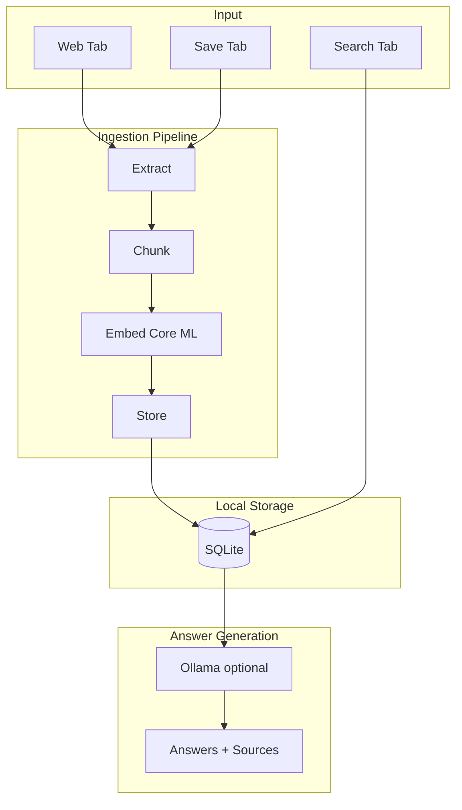

# Knowledge Cache — Pitch & Investor One-Pager

**Version:** 1.0 | **Product:** Knowledge Cache | **Platform:** macOS (native Swift/SwiftUI)

---

## 1. LinkedIn Post (Ready to Copy)

```
🚀 Built Knowledge Cache — your offline AI memory for macOS

Ever saved a link or article and forgot where it was? Or wished you could ask questions about YOUR saved content without exposing it to the cloud?

Knowledge Cache solves this:
✅ Save URLs or paste text — stored locally, searchable instantly
✅ Semantic search — find by meaning, not keywords
✅ Ask questions — answers grounded in what YOU saved (Ollama optional)
✅ 100% offline — no cloud, no accounts, your data stays yours
✅ Web tab — browse, then "Save to offline" in one click

Built with Swift, Core ML, SQLite. Embedding model runs on-device. Optional Ollama for richer answers — no model shipped with the app.

Privacy-first. Offline-first. Your knowledge, your control.

#AI #macOS #Privacy #Swift #IndieDev #BuildInPublic
```

---

## 2. Elevator Pitch (30 seconds)

**Knowledge Cache is a personal AI memory for your Mac.** Save URLs or text, and ask questions — answers come only from what you saved. Everything runs locally: no cloud, no accounts, no data leaving your machine. Semantic search finds content by meaning. Optional Ollama for richer answers. Built for people who want AI-powered knowledge without the privacy trade-off.

---

## 3. Problem & Solution

| Problem | Solution |
|--------|----------|
| Bookmarks and notes scattered, hard to find | One place: save URLs or paste text, search by meaning |
| Cloud AI tools require uploading private content | All processing on-device; no uploads |
| Keyword search misses relevant content | Semantic search (embeddings) finds by concept |
| Need to be online to use AI tools | Fully offline after initial URL fetch |
| Vendor lock-in, subscriptions | Local SQLite; no accounts; one-time install |

---

## 4. Product Architecture (Diagram)

```
┌─────────────────────────────────────────────────────────────────────────────┐
│                         KNOWLEDGE CACHE — Architecture                        │
└─────────────────────────────────────────────────────────────────────────────┘

   ┌──────────────┐     ┌──────────────┐     ┌──────────────┐
   │   Web Tab    │     │  Save Tab    │     │  Search Tab   │
   │  (DuckDuckGo │     │ (URL/Paste)  │     │  (Ask Q&A)   │
   │  + Save)     │     │              │     │              │
   └──────┬───────┘     └──────┬───────┘     └──────┬───────┘
          │                    │                     │
          ▼                    ▼                     ▼
   ┌─────────────────────────────────────────────────────────────┐
   │                    Ingestion Pipeline                        │
   │  Extract → Chunk → Embed (Core ML) → Store                   │
   └─────────────────────────────────────────────────────────────┘
          │                    │                     │
          ▼                    ▼                     ▼
   ┌─────────────────────────────────────────────────────────────┐
   │              SQLite (local) • 384-dim embeddings              │
   └─────────────────────────────────────────────────────────────┘
          │                    │                     │
          │                    │                     ▼
          │                    │              ┌──────────────┐
          │                    │              │   Ollama     │
          │                    │              │ (optional)   │
          │                    │              └──────────────┘
          │                    │                     │
          └────────────────────┴─────────────────────┘
                               │
                               ▼
                    ┌──────────────────┐
                    │  Answers + Sources │
                    │  (your data only)  │
                    └──────────────────┘
```

**Mermaid version** (for slide tools):



---

## 5. Key Features

| Feature | Description |
|---------|-------------|
| **Save** | URL or pasted text; reader-style extraction for web pages |
| **Semantic search** | 384-dim embeddings (all-MiniLM-L6-v2); L2-normalized; dot-product similarity |
| **Q&A** | Answers built from retrieved chunks; sources cited; optional Ollama for synthesis |
| **Offline-first** | No cloud; no accounts; feedback queued when offline, sent when online |
| **Web tab** | Browse DuckDuckGo; "Save to offline" in one click |
| **History** | Past questions and answers stored; works with deleted items |
| **Privacy** | Data never leaves the device; no telemetry unless opted in |

---

## 6. Tech Stack

| Layer | Technology |
|-------|------------|
| App | Swift, SwiftUI, macOS 14+ |
| Storage | SQLite (local) |
| Embeddings | Core ML (all-MiniLM-L6-v2), 384-dim |
| LLM (optional) | Ollama (llama3.2) — user installs, not shipped |
| Backend | Vercel (feedback/analytics only, optional) |

---

## 7. Investor Deck Outline (Slides)

1. **Cover** — Knowledge Cache: Your Offline AI Memory  
2. **Problem** — Bookmarks chaos, cloud AI privacy concerns, keyword search limits  
3. **Solution** — One app: save, search by meaning, ask questions — all local  
4. **Product** — Screenshots: Save, Search, Web tab, History  
5. **Architecture** — Diagram (input → pipeline → storage → answer)  
6. **Differentiators** — Privacy-first, offline, no vendor lock-in, optional Ollama  
7. **Traction** — MVP shipped; feedback server deployed; version 1.0 (7)  
8. **Roadmap** — [Add your priorities: e.g. iOS, sync, plugins]  
9. **Team** — [Your background]  
10. **Ask** — [e.g. Pre-seed, angel, advisors]  

---

## 8. Metrics to Highlight

- **Offline-capable** — Works without internet after initial save  
- **~89 MB** app size (mostly embedding model)  
- **No accounts** — Zero signup friction  
- **Optional AI** — Ollama for richer answers; deterministic fallback built in  
- **Production-ready** — Feedback, analytics, Blob storage for dashboard  

---

## 9. One-Pager (Single Page)

**Knowledge Cache** — Offline AI memory for macOS

**What:** Native macOS app that saves URLs/text, indexes with semantic embeddings, and answers questions using only your saved content.

**Why:** Privacy-conscious users want AI-powered search without uploading data to the cloud. Bookmark/snippet tools are fragmented and keyword-based.

**How:** Swift + Core ML + SQLite. Save → Chunk → Embed → Store. Search by similarity; optional Ollama for synthesized answers.

**Traction:** MVP shipped; feedback server live; v1.0 (7).

**Differentiator:** 100% offline; no accounts; semantic search; optional LLM; your data never leaves your machine.

**Contact:** [Your email / LinkedIn]

---

## 10. Tagline Options

- **"Your knowledge. Your machine. No cloud."**
- **"AI memory that stays on your Mac."**
- **"Save once. Search by meaning. Ask anything."**
- **"Offline-first AI for your personal knowledge."**
